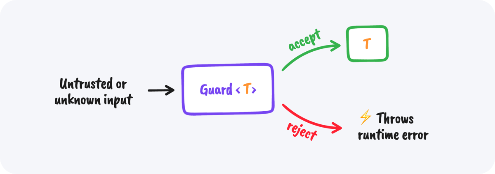

# Validate your untrusted inputs

<!-- prettier-ignore-start -->
Decoders is an elegant and battle-tested validation library for type-safe input data for
TypeScript and Flow.
{: .fs-6 .fw-300 }
<!-- prettier-ignore-end -->

[Get started now](#getting-started){: .btn .btn-primary .fs-5 .mb-4 .mb-md-0 .mr-2 }
[View it on GitHub](https://github.com/nvie/decoders){: .btn .fs-5 .mb-4 .mb-md-0 }

## Getting started

Just install the package and you're ready to go.

    $ npm install decoders

## The core idea

The central concept of this library is the Decoder. A `Decoder<T>` is a validation
function that, when called on an untrusted input, will either return an "ok" result with
the decoded value of type `T` as its payload, or an "error" result, with the original
input object annotated.


A decoder can either _accept_ or _reject_ the given untrusted input. Whether it accepts or
rejects depends on the decoder's implementation. The return value always is either an "ok"
or an "error" result (aka a `DecodeResult<T>`)—it will never throw an exception at
runtime. That's what Guards do.

The second important concept is a Guard. It's a convenience wrapper around an existing
decoder. A `Guard<T>` is like the Decoder that it wraps, but does not return those
intermediate "result" objects that Decoders do.



When called on an untrusted input, it will either directly return the decoded value, or
throw an error. This allows you to not have to deal with the intermediate "ok" and "err"
results returned by the Decoder.

## Understanding the "type" of a Decoder

Every decoder has a type, for example when you see a decoder of type `Decoder<string>` it
means that _if_ it accepts the runtime input, it will always return a `string`.

It does **not** mean it will only accept string inputs! Take the `truthy` decoder as an
example. That one will accept _any_ input value, but return a `boolean`. What values will
get accepted by a decoder depends on its implementation. The decoder's documentation will
tell you what inputs it accepts.

## Composing decoders

You can compose decoders together to build larger decoders. For example, here you can see
how you can use decoders as building blocks to describe any data shape you expect:

<!-- prettier-ignore-start -->
```typescript
import { array, number, object, string } from 'decoders';

   object({
     name: string,
//         ^^^^^^ Decoder<string>
     items: array(number),
//                ^^^^^^ Decoder<number>
//          ^^^^^^^^^^^^^ Decoder<number[]>
   })
// ^^ Decoder<{ name: string; items: number[] }>
```
<!-- prettier-ignore-end -->

## Motivation

In a fully type-checked app, data coming in from the outside world can be dynamic and
should not be trusted without validation. Therefore, it's a good practice to validate your
expectations right at your program's boundaries. This has two benefits: (1) your inputs
are getting validated, and (2) you can now statically know for sure the shape of the
incoming data.

Decoders help solve both of these problems.

## An example

TODO: Find a better, real world, example.

<!--
Suppose you define a decoder for a `Person`:

```typescript
import { email, iso8601, name, positiveNumber } from 'decoders';

const personDecoder: Decoder<Person> = object({
    id: positiveNumber,
    name: string,
    email: email,
    dateOfBirth: iso8601,
});
```

For example, say your app expects a list of points in an incoming HTTP request:

```javascript
{
  points: [
    { x: 1, y: 2 },
    { x: 3, y: 4 },
  ],
}
```

In order to decode this, you'll have to tell Flow about the expected structure, and use
the decoders to validate at runtime that the free-form data will be in the expected shape.

```javascript
type Point = { x: number, y: number };

type Payload = {
    points: Array<Point>,
};
```

Here's a decoder that will work for this type:

```javascript
import { array, guard, number, object } from 'decoders';

const point = object({
    x: number,
    y: number,
});

const payload = object({
    points: array(point),
});

const payloadGuard = guard(payload);
```

And then, you can use it to decode values:

```javascript
>>> payloadGuard(1)      // throws!
>>> payloadGuard('foo')  // throws!
>>> payloadGuard({       // OK!
...     points: [
...         { x: 1, y: 2 },
...         { x: 3, y: 4 },
...     ],
... })
```
-->
