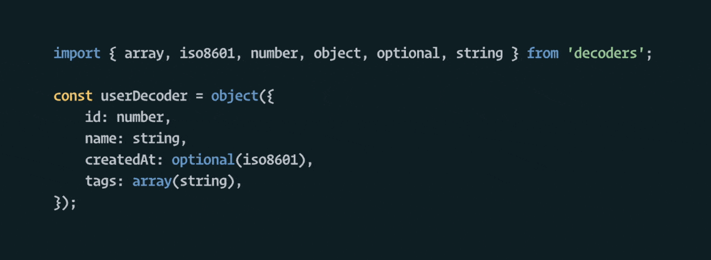

<!-- prettier-ignore-start -->
# Validate untrusted inputs
{: .fs-8 .fw-400 }
<!-- prettier-ignore-end -->

<!-- prettier-ignore-start -->
Decoders is an elegant and battle-tested validation library for type-safe input data for
[TypeScript](https://www.typescriptlang.org/) and [Flow](https://flow.org/).
{: .fs-6 .fw-300 }
<!-- prettier-ignore-end -->

[Get started now](#getting-started){: .btn .btn-primary .fs-6 .mb-4 .mb-md-0 .mr-4 .px-5
.py-3 } [See all decoders](https://decoders.cc/api.html){: .btn .fs-6 .mb-4 .mb-md-0 .px-5
.py-3 }

## Getting started

Just install the package and you're ready to go.

    $ npm install decoders

(If you use decoders with a Node version older than version 10, you may have to
[manually include some polyfills](https://github.com/nvie/decoders/issues/884#issuecomment-1202054523).)

## Motivation

Data entering your application from the outside world should not be trusted without
validation and often is of the `any` type, effectively disabling your type checker around
input values. It's an industry good practice to validate your expectations right at your
program's boundaries. This has two benefits: (1) your inputs are getting validated, and
(2) you can now statically know for sure the shape of the incoming data. **Decoders help
solve both of these problems at once.**

## Example

Suppose, for example, you have an endpoint that will receive user data:

```typescript
import { array, iso8601, number, object, optional, string } from 'decoders';

//
// Incoming data at runtime
//
const externalData = {
  id: 123,
  name: 'Alison Roberts',
  createdAt: '1994-01-11T12:26:37.024Z',
  tags: ['foo', 'bar'],
};

//
// Write the decoder (= what you expect the data to look like)
//
const userDecoder = object({
  id: number,
  name: string,
  createdAt: optional(iso8601),
  tags: array(string),
});

//
// Call .verify() on the incoming data
//
const user = userDecoder.verify(externalData);
//    ^^^^
//    TypeScript can automatically infer this type now:
//
//    {
//      id: number;
//      name: string;
//      createdAt?: Date;
//      tags: string[];
//    }
//
```

## The core idea

The central concept of this library is the Decoder. A Decoder is a construct that can help
you verify that untrusted external input matches your expectations. Untrusted data is
basically any variable of type `any` or `unknown`.

This way, you can be sure that all untrusted runtime data is always in the shape you
expect, and that static types can correctly be inferred for dynamic input data.

All decoders have an associated type, for example `Decoder<string>`, or
`Decoder<number[]>`, etc. When you use a `Decoder<T>` on untrusted input, it will either
"accept + return" something of type `T`, or "reject" the value.

Generic/small decoders are typically stacked together like LEGO® pieces to build
larger/custom decoders. In the example above, you have already seen many decoder
instances!



### Using a decoder

To use a decoder on an untrusted input, call one of these three methods on the outermost
decoder. Which one you want to use will depend on your use case.

- `.verify()` (= recommended)
- `.value()` (for best-effort decoding)
- `.decode()` (for precise control)

The simplest and recommended method is [`.verify()`](/Decoder.html#verify). It will either
return the decoded (safe) value on success, or throw an error with a friendly message when
the decoding failed.


Alternatively, you can use the [`.value()`](/Decoder.html#value) method which will not
throw, but instead return `undefined` when the decoder rejects the input. Use this when
you don't care about erroring in the face of unexpected input data. For example to use it
as a "best effort" attempt:


> _**Caveat!** You won't be able to distinguish between a legal `undefined` value or a
> decoding error this way._

Lastly, you can use the lower-level [`.decode()`](/Decoder.html#decode) method if you want
to have most programmatic control over the result. It works like
[`.verify()`](/Decoder.html#verify), but instead of directly returning a value or failing,
it returns a "Result" value, which can either have `ok: true` (and a value), or
`ok: false` and an error annotation.


You'll typically only use this method directly when implementing your own decoders.

## Understanding the "type" of a Decoder

Every decoder has a type, for example when you see a decoder of type `Decoder<string>` it
means that _if_ it accepts the runtime input, it will always return a `string`.

It does **not** mean it will only accept string inputs! Take the `truthy` decoder as an
example. That one will accept _any_ input value, but return a `boolean`. What values will
get accepted by a decoder depends on its implementation. The decoder's documentation will
tell you what inputs it accepts.

## Building your own decoders

You are encouraged to build your own decoders that serve your use case. For documentation
and examples, see [Building your own](/building-your-own.md).

## Formatting error messsages

By default, `.verify()` will use the `formatInline` error formatter. You can pass another
built-in formatter as the second argument, or provide your own. (This will require
understanding the internal `Annotation` datastructure that decoders uses for error
reporting.)

Built-in formatters are:

- `formatInline` (default) — will echo back the input object and inline error messages
  smartly. Example:

  ```typescript
  import { array, object, string } from 'decoders';
  import { formatInline } from 'decoders/format';

  const mydecoder = array(object({ name: string, age: number }));

  const externalData = [{ name: 'Alice', age: '33' }];
  mydecoder.verify(externalData, formatInline);
  ```

  Will throw the following error message:

  ```text
  Decoding error:
  [
    {
      name: 'Alice',
      age: '33',
           ^^^^ Must be number
    },
  ]
  ```

- `formatShort` — will report the _path_ into the object where the error happened.
  Example:

  ```typescript
  import { formatShort } from 'decoders/format';
  mydecoder.verify(externalData, formatShort);
  ```

  Will throw the following error message:

  ```text
  Decoding error: Value at keypath 0.age: Must be number
  ```
