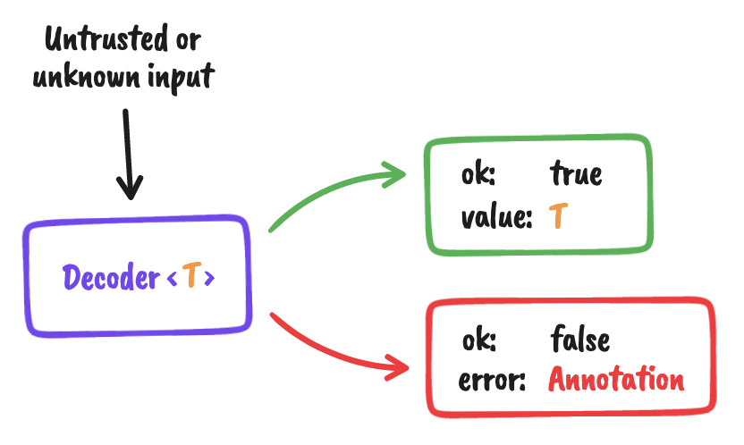

## The core concept

The central concept of this library is the Decoder. A `Decoder<T>` is a validation
function that, when called on an untrusted input, will either return an "ok" result with
the decoded value of type `T` as its payload, or an "error" result, with the original
input object annotated.



A decoder can either _accept_ or _reject_ the given untrusted input. Whether it accepts or
rejects depends on the decoder's implementation. Every decoder has a type, for example
when you see a decoder of type `Decoder<string>` it means it will always return a string
_if_ it accepts the input. It does not mean it will only _accept_ strings. You can
implement a decoder that will only _accept_ numbers, but return strings. What values are
accepted by a decoder depends on its implementation. See its documentation to learn what
it accepts.

## Why?

If you're using Flow or TypeScript to statically typecheck your JavaScript, you'll know
that any data coming from outside your program’s boundaries is essentially untyped and
unsafe. "Decoders" can help to validate and enforce the correct shape of that data.

For example, imagine your app expects a list of points in an incoming HTTP request:

```javascript
{
  points: [
    { x: 1, y: 2 },
    { x: 3, y: 4 },
  ],
}
```

In order to decode this, you'll have to tell Flow about the expected structure, and use
the decoders to validate at runtime that the free-form data will be in the expected shape.

```javascript
type Point = { x: number, y: number };

type Payload = {
    points: Array<Point>,
};
```

Here's a decoder that will work for this type:

```javascript
import { array, guard, number, object } from 'decoders';

const point = object({
    x: number,
    y: number,
});

const payload = object({
    points: array(point),
});

const payloadGuard = guard(payload);
```

And then, you can use it to decode values:

```javascript
>>> payloadGuard(1)      // throws!
>>> payloadGuard('foo')  // throws!
>>> payloadGuard({       // OK!
...     points: [
...         { x: 1, y: 2 },
...         { x: 3, y: 4 },
...     ],
... })
```

## Understanding decoders and guards

At the heart, a decoder is a function that will take _any_ unsafe input, verify it, and
either return an "ok" or an annotated "err" result. It will never throw an error when
called.

A guard is a convenience wrapper which will use the decoder

### Building custom decoders

There are two main building blocks for defining your own custom decoders: `map()` and
`compose()`.

There are roughly 3 use cases that you will want to use:

1. **[Transformation](#transformation)** (i.e. read one type, but return another, or read
   a type but change its value before returning)
1. **[Adding extra value requirements](#adding-predicates)** (i.e. decode using an
   existing decoder, but require an extra value check)
1. **Chaining** multiple decoders (less common, more advanced)

#### Transformation

To read one type from the input, but return another, use:

```js
const numericString: Decoder<number> = map(
    // At runtime, expect to read a string...
    string,
    // ...but return it as a number
    (s) => Number(s),
);
```

To read one type, but change its value before returning:

```js
const upperCase: Decoder<string> = map(string, (s) => s.toUpperCase());
```

**WARNING:** While you can map anything to anything, it's typically **NOT A GOOD IDEA to
put too much transformation logic inside decoders**. It's recommended to keep them minimal
and only try to use them for the most basic use cases, like in the examples above. Keeping
business logic outside decoders makes them more reusable and composable.

#### Adding predicates

The easiest way to decode using an existing decoder, but enforcing extra runtime checks on
their values is by wrapping it in a `predicate(...)` construction:

```js
const odd = predicate(integer, (n) => n % 2 !== 0, 'Must be odd');
const shortString = predicate(string, (s) => s.length < 8, 'Must be less than 8 chars');
```
